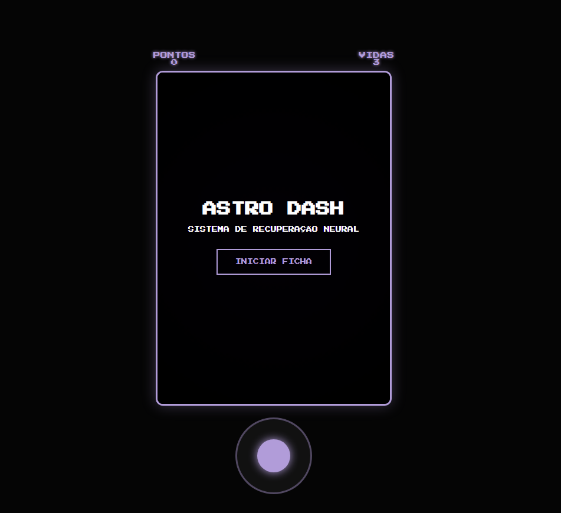

# Mini-game-com-JS
# 🚀 Astro Dash - Sistema de Recuperação Neural
git add .

Este projeto é um mini-game arcade com estética **Cyberpunk/Neon**, desenvolvido para aplicar conceitos de 
lógica de programação, manipulação de DOM e design responsivo.

## 🛸 A Origem do Projeto
A ideia do **Astro Dash** nasceu de forma totalmente inesperada durante uma aula da faculdade de **Engenharia de Software**. 
Enquanto estudava, minha mente literalmente "viajou para o espaço". Decidi transformar essa inspiração em um projeto prático
 e aleatório para testar minhas habilidades e, em breve, compor meu portfólio de transição para a área de TI.

## 🛠️ Tecnologias Utilizadas
* **HTML5**: Estruturação da arena e interface do usuário.
* **CSS3**: Estilização Neon, animações de rotação e efeitos de sombra nos asteroides.
* **JavaScript (Vanilla)**: Motor do jogo, detecção de colisões, sistema de pontuação e lógica de movimentação híbrida.

## 🎮 Funcionalidades
* **Controle Híbrido**: Jogue no PC usando as teclas `W, A, S, D` ou setas, e no celular através de um **Joystick virtual** 
customizado.
* **Dificuldade Progressiva**: A velocidade de surgimento dos obstáculos aumenta conforme você pontua.
* **Sistema de Vidas**: O jogador inicia com 3 vidas, podendo recuperar integridade a cada 300 pontos (limite máximo de 5 vidas).
* **Identidade Visual**: Arte inspirada na cultura geek e no estilo **Kawaii/Chibi**, unindo tecnologia e ilustração.

## 🕹️ Como Jogar
1. Acesse o site oficial do jogo (link abaixo).
2. Insira seu Nick para iniciar o protocolo de boot.
3. Desvie dos asteroides rochosos para ganhar pontos.
4. Colete os itens de cura `✚` para recuperar suas vidas.

---

## 🔗 Teste o Jogo Aqui
[Clique aqui para jogar o Astro Dash](https://adriellejcds.github.io/Mini-game-com-JS/)
*(Certifique-se de ativar o GitHub Pages nas configurações do seu repositório para o link funcionar)*

---
Desenvolvido com 💜 por **Adrielle Santos (Jinnie)**